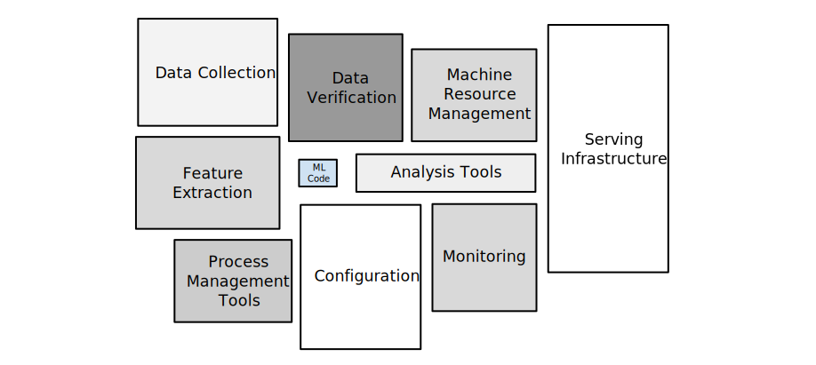

# Machine Learning Operationalization (MLOps)

Training machine learning models and getting great performance is worth celebrating. Putting it into production, however, is another story.

### <ins> Setting up an End-To-End ML System in the Real World

These are the common steps we need to follow in order to set up an ML system in the real world:

1. ***Scoping and business problem understanding***. ML is cool but it needs to bring values to customers and align with an organization's business goals. Being able to understand the business problem and tranlating the business problem into an ML problem is a key first step. Also, ML is not a cure-all but instead is only one approach to solving any problem.
2. ***Metrics***. For any ML project setup it's usually helpful to have a **single number metric** to guide the decision process. In an *offline* setting, we can choose one metric (F1 score, NDCG, etc.) to select the best ML model, while in an *online* setting, we may need to adapt a different metric where the offline metric is only part of the equation - the goal is to make sure the product improves as a whole (e.g., highest user engagement rates). And this is also a good time to **establish a baseline** for the ML system.
3. ***Techinical requirements understanding***. Say ML is the approach we want to take, the next step is to understand the techincal requirements and other parts of the whole prodcut/system. What's the scale of the data? Do we need real-time inference or is batch workload fine? For real-time inferences, what is the latency requirment? What's the throughput? These are just a couple of example questions and answers to these questions would lead us to design the architecture of the ML system.
4. ***Architecture design***. After figuring out all the techincal requirements and details, we need to identify key components and design the arachitecture of the ML system, as well as how it interfaces with other systems.
5. ***Training data acquisition/generation***. Following the previous steps, we need to ask these questions: How do we get training data? Do we need to hire people or use a specific tool to label the data, or can we users' implict feedback as labels? No matter how good a learning algorithm is, if we don't have high quality training data, the system is doom to fail.
6. ***Feature Engineering***. This is another crucial step as good features influence the model’s ability and boost its performance. A great business understanding of the data + creativity + good engneering would help us create good features for a given ML task
7. ***Offline model training and selection***. Are we training models from scracth, or are there state of the art pre-training results we can leverage? What algorithms to use and what hyperparameters to choose (model training and parameter tuning can be fun initially but the task can become mechanical after a while; that's when tools such as [Hyperopt](https://hyperopt.github.io/hyperopt/) comes into play)?
8. ***Online testing***. After training and getting a great model offline, it's time to test it in the real world. Initially we should apply a canary deployment, where we roll out the model to only a small fraction (3-5%) of the traffic. We should monitor the performace and ramp up only when we observe better overall performace based on the online metric we definted earlier.
9. ***MLOps***. While MLOps is listed lastly, it's by no means the least important. While we may afford to do things manually at first just to see if ML would even work, to put ML into production in a similar fashion as we would for software we need to automate the process. We can leverage tools such as [MLflow](https://www.mlflow.org/docs/latest/index.html) to help manage the end-to-end machine learning lifecycle.

A couple of notes:

- While I listed all the previous steps, it doesn't mean you need to consider all of the them if you are just doing a quick and dirty prototype to check the feasibility of an ML system. Use your judgement call to skip a couple of steps here and there
-  ML is highly iterative in its nature. While some steps, such as business scoping and metrics, change less frequently, feature engineering and model training for examples can iterate very fast, which is a good thing because that's how your model improve. So don't assume the previous steps would follow a linear fashion.

### <ins> Static vs. Dynamic Training

- A ***static model*** is trained offline. That is, we train the model exactly once and then use that trained model for a while.
- A ***dynamic model*** is trained online. That is, data is continually entering the system and we're incorporating that data into the model through continuous updates.

Static models are easier to build and test, while dynamic models adapt to changing data.

### <ins> Offline vs. Online Inference

- ***Offline inference***: making all predictions in a batch, e.g., done by nightly cron job
- ***Online inference***: making prediction on demand and in real time

Usually online inference is more latency sensitive so we might need to limit the model complexity. Also online inference may require more intensive monitoring.

### <ins> Data Dependencies

The behavior of an ML system is dependent on the behavior and ***qualities of its input features***: As the input data for those features changes, so will your model.

In traditional software development, you focus more on code than on data. In machine learning development, although coding is still part of the job, your focus must widen to include data: you must ***continuously test, verify, and monitor your input data***.

Pay attention to the follow aspects:
- ***Reliability***: Is the dependant data always going to be available or is it coming from an unreliable source?
- ***Versioning***: Does the system that computes this data ever change, and if so how often?
- ***Necessity***: Does the usefulness of the data/feature justify the cost of including it?
- ***Correlations***: Are any features so tied together that you need additional strategies to tease them apart??
- ***Feedback Loops***: Sometimes a model can affect its own training data. For example, the results from some models, in turn, are directly or indirectly input features to that same model or other models. So are we reinforcing bias?

Feedback loops can be tricky to detect and may 'break the whole system'. For example, we may train a book-recommendation model that suggests novels its users may like based on their popularity (i.e., the number of times the books have been purchased). It, however, will only make the popular ones more popular and not so popular ones even less popular, in a way reinforcing biases.

### <ins> Human Bias

Machine learning models are not objective. It was trained by humans, and human involvement can a model's predictions susceptible to bias.
- Common [types of bias](https://developers.google.com/machine-learning/crash-course/fairness/types-of-bias)
- How to [identify bias](https://developers.google.com/machine-learning/crash-course/fairness/identifying-bias)
- How to [evaluate for bias](https://developers.google.com/machine-learning/crash-course/fairness/evaluating-for-bias)

### <ins> MLflow

[MLflow](https://www.mlflow.org/docs/latest/index.html) is a library-agnostic platform for managing the end-to-end machine learning lifecycle.

It tackles four primary functions:

- ***Tracking experiments*** to record and compare parameters and results (MLflow Tracking).
- ***Packaging ML code in a reusable, reproducible form*** in order to share with other data scientists or transfer to production (MLflow Projects).
- ***Managing and deploying models*** from a variety of ML libraries to a variety of model serving and inference platforms (MLflow Models).
- ***Providing a central model store*** to collaboratively manage the full lifecycle of an MLflow Model, including model versioning, stage transitions, and annotations (MLflow Model Registry).
